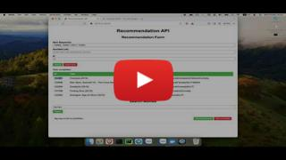
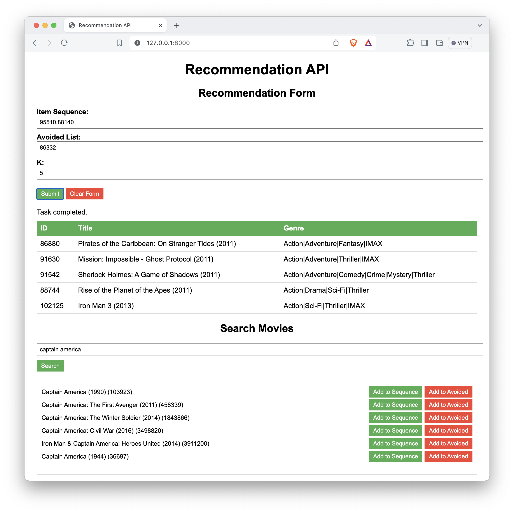

# SEQUENTIAL MOVIE RECOMMENDATION SYSTEM POWERED BY BERT4REC MODEL

## Introduction

This project aims to implement the BERT4Rec model, a neural network-based recommendation system that leverages the power of the Transformer architecture. The BERT4Rec model is trained on the MovieLens dataset to provide personalized movie recommendations based on users' interaction histories.

The project encompasses training the BERT4Rec model, evaluating its performance, and deploying a web-based recommendation API using FastAPI and Celery. The API allows users to obtain movie recommendations based on their past interactions with the system.

### Demo Video
[](https://youtu.be/BpJuPY05JqI)


### Quick deployment
Note: you need to install `redis-server`, `python3.9` and `pip3` first
- Init project
```
chmod +x ./run_init.sh
. ./run_init.sh
```
- Run deployment
```
chmod +x ./run_deploy.sh
. ./run_deploy.sh
```

Or we can run with docker, but **it's extremely time-consuming** because I do not have time to optimize in building image
```
docker-compose -f deploy/docker-compose.yml --project-directory . up --build
```

## Demo Page Usage

The demo page allows you to interact with the Sequential Movie Recommendation System powered by the BERT4Rec model.

### How to Use

* **Submit a Recommendation Request**: to get the recommendations for **ONE** next movie based on the specified sequence
   - **Item Sequence**: Enter movie IDs separated by commas to specify the movies you've watched.
   - **Avoided List**: Enter movie IDs separated by commas to specify the movies you want to avoid in recommendations.
   - **K**: Enter the number of candidates you want, with descending order by score
   - Click **Submit** to enqueue the recommendation task and get recommendations.

* **Search for Movies**
   - **Search Bar**: Enter movie titles to search for specific movies.
   - Click **Search** to display the search results.

* **Add to Sequence/Add to Avoided**
   - In the search results, you can use the **Add to Sequence** button to add a movie's ID to your watched sequence.
   - Use the **Add to Avoided** button to add a movie's ID to your avoided list.
   - These buttons help build your recommendation context dynamically based on your preferences.

* **Clear the Form**
   - Click **Clear Form** to reset all input fields.

### Example

* **Search for Movies**: Enter a movie title in the search bar, such as "Captain America", and click **Search**.
* **Add to Sequence**: In the search results, click the **Add to Sequence** button next to "Captain America" to include it in your watched sequence.
* **Submit Recommendation Request**:
   - **Item Sequence**: `95510,88140` (where `88140` is the ID for "Captain America: The First Avenger (2011)")
   - **Avoided List**: `86332` (where `86332` is the ID for "Thor (2011)")
   - **K**: `5`
* Click **Submit** to get result 




## Detailed Guidelines

### Prepare Environment

```
mkdir -p resources/datasets resources/checkpoints resources/db logs
python3 -m venv venv
source venv/bin/activate
pip3 install -r requirements.txt
```

Prepare environment variables:

```
cp .env_org .env
```

Now you can edit .env to change values. Here's the section with notes for each environment variable:
```
MOVIELENS_VERSION=ml-25m  # Specify the MovieLens dataset version to use (ml-25m, ml-100k, ml-1m, ml-10m, or ml-20m)
DATASET_ROOT=./resources/datasets/  # Path to the directory where the dataset files will be stored
DATABASE_ROOT=./resources/db/  # Path to the directory where the database files will be stored

REDIS_HOST=localhost  # Host for the Redis server
REDIS_PORT=6379  # Port for the Redis server
REDIS_CELERY_DB=0  # Redis database number for Celery

RECSYS_HOST=localhost  # Host for the recommendation system API
RECSYS_PORT=8001  # Port for the recommendation system API
RECSYS_SEQ_LENGTH=120  # Length of the user interaction sequence used by the recommendation system
RECSYS_DEVICE=cpu  # Device to use for the recommendation system (cpu or cuda)
RECSYS_SECRET=secret_key  # Secret key for the recommendation system API

WEB_HOST=localhost  # Host for the web application
WEB_PORT=8000  # Port for the web application
```

### Prepare Data

Open the `.env` file and set `MOVIELENS_VERSION` to one of the following options: `ml-25m`, `ml-100k`, `ml-1m`, `ml-10m`, or `ml-20m`.

Then download the original dataset and dump to a SQLite database
```
python3 run_dump_data.py
```

Or you can download the dumped SQLite file for `ml-25m` **(BUT ONLY FOR DEPLOYMENT)**
```
wget -O resources/db/ml-25m.db "https://uithcm-my.sharepoint.com/:u:/g/personal/18520216_ms_uit_edu_vn/EYa_K9yjDGdFtMKJtRZpHUwBsRtJSw1V5JedZJA6-Ch42g?e=yUDQaZ&download=1"
```

### Train and Evaluate Model

Only the checkpoint trained on `ml-25m` is provided. To download the pre-trained checkpoint, run:

```
wget -O resources/checkpoints/bert4rec_ml-25m_best.ckpt "https://uithcm-my.sharepoint.com/:u:/g/personal/18520216_ms_uit_edu_vn/EVCvHZg7QFZGlis704IiPdIBMJxIK37tcVGUM9zY-LzlCw?e=tCgA0J&download=1"
```

To train the model, run:

```
python3 run_train.py --batch_size 32 --hidden_size 128 --epochs 90
```

To evaluate the trained model, run:
```
python3 run_train.py --batch_size 32 --hidden_size 120 --epochs 0
```

Note:

- `hidden_size`: token embedding dimension
- `seq_length`: length of the interaction sequence
- `epochs`: number of training epochs

To view Tensorboard while training the model, run:

```
tensorboard --logdir logs --port 6006
```

### Model Inference Example

```
python3 run_example.py
```

### Deploy Recommendation API

```
python3 run_redis.py
```

Then, open another terminal tab and run:

```
celery -A run_api.celery worker --loglevel=info --pool=solo
```

Then, open another terminal tab and run:

```
uvicorn run_api:app --reload
```

## Coding Convention

Pre-commit is configured using the `.pre-commit-config.yaml` file. To install pre-commit, simply run inside the shell:

```bash
pre-commit install
```

By default, it runs:

- black (formats code)
- mypy (validates types)
- isort (sorts imports in all files)
- flake8 (spots possible bugs)
